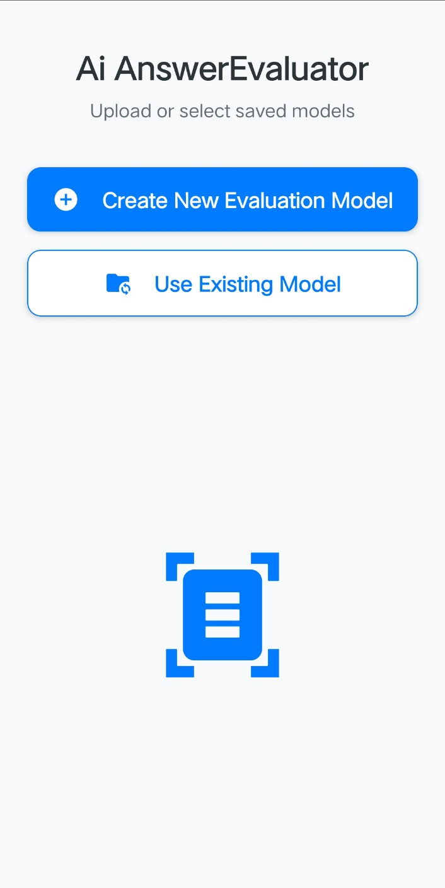
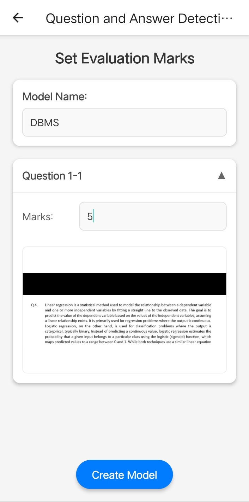
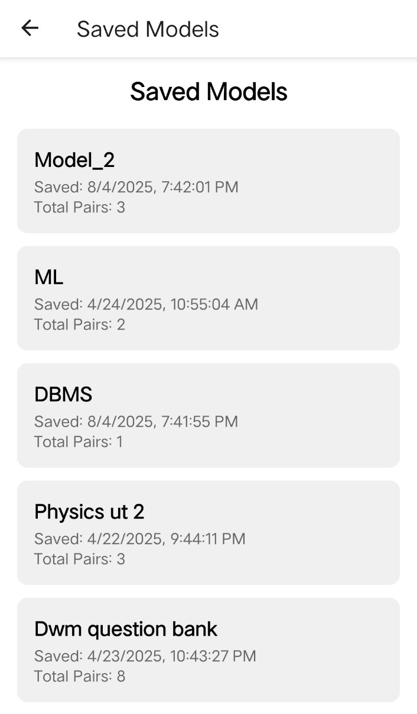
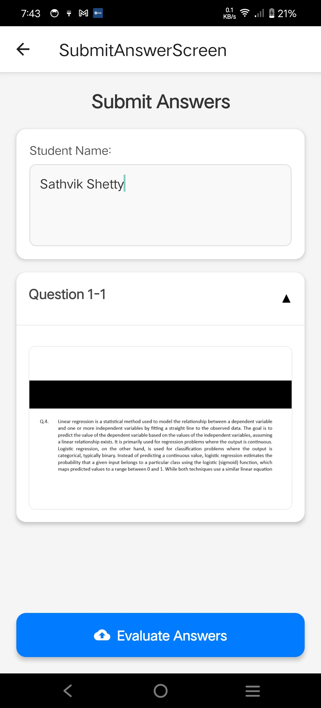
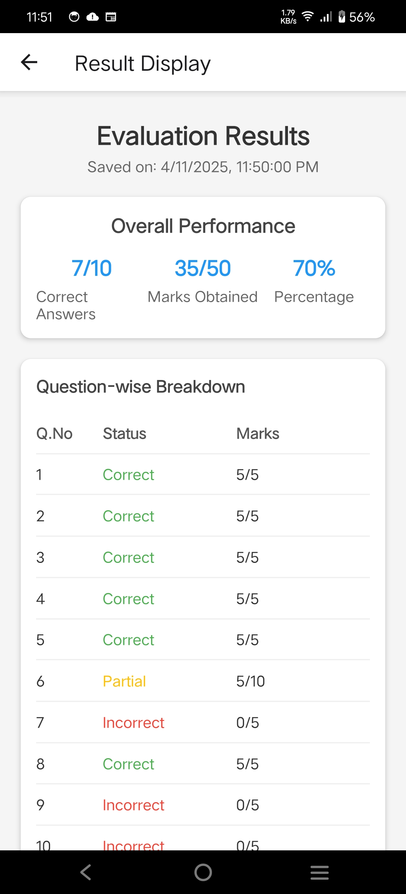
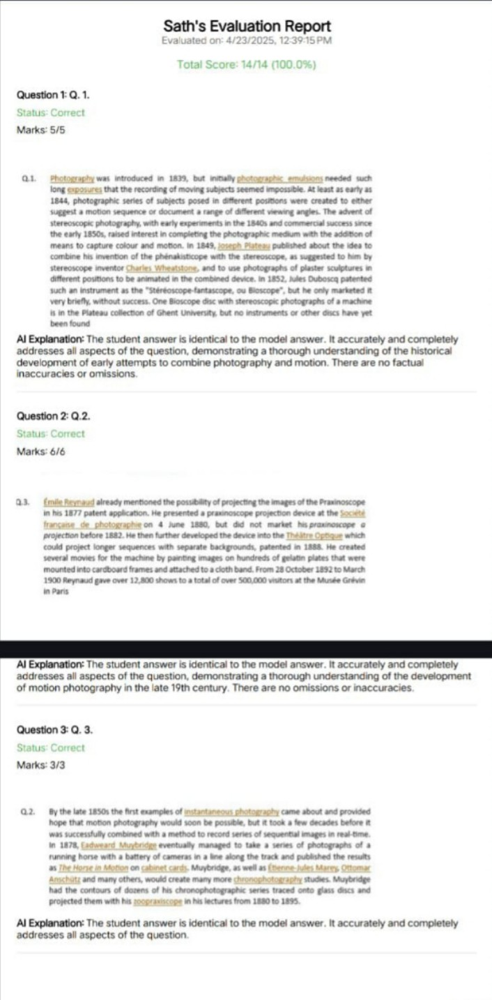

# 🧠 AI Answer Evaluator

AI Answer Evaluator is a semi-automated system for evaluating handwritten or scanned student answer sheets. It uses object detection to identify questions, answers, and pair regions, and applies OCR to extract text. The system allows users to assign marks to model answer pairs manually, and then automatically evaluates student answers by matching them against the reference model.

---

## 🚀 Features

- ✅ Object Detection (`Question`, `Answer`, `Pair`) using YOLOv8
- 🔍 OCR-based Text Extraction (Google Vision API)
- 🧠 Intelligent Question-Answer Pair Detection
- 🖼️ Cropping and Preview of Detected Regions
- ✍️ Manual Marks Input for Model Answer Sheet
- 🤖 Auto-Evaluation of Student Sheets Based on Model Marks
- 🔄 Supports Multiple Questions Per Image
- 📁 Save and Load Evaluation Results

---

## 🛠️ Tech Stack

| Component        | Technology                      |
|------------------|----------------------------------|
| Frontend         | React Native                    |
| Backend          | Flask                           |
| Object Detection | YOLOv8n (Ultralytics)           |
| OCR              | Google Vision                   |
| Storage          | Firebase (Firestore & Storage)  |

## 📸 Screenshots

| Starting Page | Input Marks for Model | Select Saved Reference |
|:-------------:|:---------------------:|:-----------------------:|
|  |  |  |

| Enter Student Info | Evaluate Answers | Download PDF with AI Feedback |
|:------------------:|:----------------:|:-----------------------------:|
|  |  |  |

  
<b>📋 Screenshot Descriptions</b>

- **Starting Page**: Home screen for launching the evaluation workflow  
- **Input Marks for Model**: Assign marks manually to each detected model Q-A pair  
- **Select Saved Reference**: Choose a previously saved reference model for evaluation  
- **Enter Student Info**: Fill student details before starting evaluation  
- **Evaluate Answers**: System runs detection, matching, and scoring  
- **Download PDF with AI Feedback**: Final result with feedback is saved as a downloadable PDF  

---

## 📊 Dataset

- Annotated and exported via **[Roboflow](https://roboflow.com/)**
- Dataset contains 3 classes: `Question`, `Answer`, `Pair`
- Format: Pascal VOC XML
- 📂 **[View and Download Dataset on Roboflow](https://app.roboflow.com/student-kaeco/question-answer-pair)**

---

## 🧠 Models

- 🤗 **[Answer-Evaluator-Model on Hugging Face](https://huggingface.co/Sathvik19/Answer-Evaluator-Model/tree/main)**  
  Trained to detect `Question`, `Answer`, and `Pair` regions from scanned images using object detection.

- 🤗 **[Questions-Answers-Detection on Hugging Face](https://huggingface.co/Sathvik19/Questions-Answers-Detection/tree/main)**  
  A secondary model trained on similar data for experimental use or performance comparison.

---

## 🛠️ Features

- Object Detection (YOLOv8)
- Text Extraction (OCR)
- Semantic Matching with Model Answers
- Score Evaluation Logic
- Flask API Server
  
## 📦 Downloads

- 📱 **[Download Android APK](https://huggingface.co/datasets/Vignesh0401/AI-Answer-Evaluator/blob/main/app-release.apk)**  
  Try the AI Answer Evaluator Android app.

